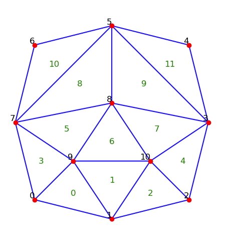
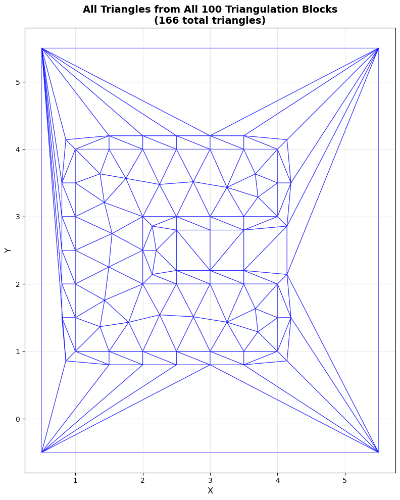

# Genesis of This Case

This case was created to verify `convert2degas2` tool and related functions.
At first, we were trying to directly convert the LTX mesh, but it was difficult
to track down each of the arrays produced by both the original `definegeometry2d` and
our tool `convert2degas2`. To make a case that we could manually track
and understand what each arrays actually mean in `geometry.nc` files.
We started with a simple box geometry, but `definegeometry2d` was not
working with it (I suspect it was due to the limitation 
of the wall walking algorithm) and it was too simple to have all
kinds of behaviors. Then we created a relatively complex geometry
with `GMSH`'s Python API by hand and got
[minDG2mesh.msh](./original-mesh-files/minDG2Mesh.msh).



*The original mesh we started with.*

This mesh is created in such a way that no two edges are colinear because then
`definegeometry2d` will merge them into one quadratic surface and we do
not want to handle that.

After creating this mesh, we had to convert it in two ways:
1. Convert to `geometry.nc` using `definegeometry2d` which is the original way to create the geometry file for `degas2`.
2. Convert to `.osh` file first so that we can feed it to `convert2degas2` and get the `geometry.nc` file.

### 1. Convert to `geometry.nc` using `definegeometry2d`
To convert the mesh from `minDG2mesh.msh` to `geometry.nc` using `definegeometry2d`, we have to convert the mesh to `XGC` format. We used [`Omega_h`](https://github.com/SCOREC/omega_h/) tools [`msh2osh`](https://github.com/SCOREC/omega_h/blob/master/src/msh2osh.cpp) and [`osh2xgc`](https://github.com/SCOREC/omega_h/blob/master/src/osh2xgc.cpp) to get the `XGC` format mesh. It creates a `.ele` and `.node` files. Then these flies are processed using `Degas2`'s [`setup_xgc_case`](https://github.com/gjwilkie/degas2/blob/1ffbc774a52784afba91be2e482a9303d36df4fb/scripts/xgccouple.py#L19) function to get the `geometry.nc` file. It creates a wall layer, runs `definepolygons` and then runs `definegeometry2d` to get the final `geometry.nc` file. The output file is stored here for test cases and reference as [definegeometry2d-geometry.nc](./definegeometry2d-geometry.nc).


### 2. Convert to `.osh` file first so that we can feed it to `convert2degas2`
After a lot of debugging attempts, we finally realized that `definegeometry2d` was not only
creating a boundary wall layer but also embeds the whole geometry in a bounding rectangle as shown
below.


Therefore, to create a comparable mesh, we cannot rely only on the `TOMMS` [`addBoundaryLayer`](https://github.com/Fuad-HH/tomms/blob/simapis-mod/xgc/utilities/addBoundaryLayer.cpp). And it wouldn't create the exact same mesh too. So we had to extract the mesh from `definegeometry2d`'s internal arrays. We could not reverse engineer the mesh from the output `geometry.nc` file because in the `geometry.nc` file, the geometry is already revolved around the Z-axis and the edges are already made into quadratic surfaces. So we had to extract it at the intermediate step. To get it, we had to modify the [`definegeometry2d.web`](https://github.com/gjwilkie/degas2/blob/1ffbc774a52784afba91be2e482a9303d36df4fb/src/definegeometry2d.web#L6757) source file to print out the triangles connectivity and node coordinates.

```diff
diff --git a/src/definegeometry2d.web b/src/definegeometry2d.web
index dc4e0ae..03ec9a0 100644
--- a/src/definegeometry2d.web
+++ b/src/definegeometry2d.web
@@ -6755,6 +6755,9 @@ int (*markers)[4];
   }
   *ntriangles=final->numberoftriangles;

+  printf("Final triangulation:\n\n");
+  report(final, 0, 1, 0, 1, 0, 0, 1);
+
   free(in.pointlist);
   free(in.segmentlist);
   free(in.pointmarkerlist);
```

This dumped all the triangles after the geometry is complete in `definegeometry2d`. Based on this,
we extracted the triangles and nodes using the scripts in [`nc2mesh.ipynb`](https://github.com/Fuad-HH/Degas2-Geom-Debug/blob/main/nc2mesh.ipynb). From this `maplotlib.tri` object, we created
the `.msh` and `.osh` files. After that, we had to modify the `.osh` file to add the `isOnWall`
and `offset_face` tags (used [this program](https://github.com/Fuad-HH/Degas2-Geom-Debug/blob/main/src/set_tags.cpp)). Finally, the [`tagged-dg2mesh.osh`](./tagged-dg2mesh.osh) file ready to be used in `convert2degas2`. A standard one is stored for test cases
as [gold-geometry.nc](./gold-geometry.nc).

## Run the Degas2 Case
In the tests, we only compare the created `geometry.nc` files from both methods. But to run the case the created geometry file, we need `degas2`
installation and related input files. An example case is given in [`degas2-case`](./degas2-case) folder. To run the case, you can follow the instructions in the [`README.md`](./degas2-case/README.md) file.

## Special Findings Regarding `definegeometry2d`
With this case, we found that the outermost boundary created by `definegeometry2d` is always a rectangle and each edge can only have
a single triangle adjacent to it. To connect with one layer of elements for concave geometry, `definegeometry2d` fills the concave part with triangles and then creates a bounding rectangle around the geometry.



*The sideways U shape is the original geometry, then a wall layer is created around it (using degas2 python script `setup_xgc_case`), and then the bounding rectangle is created around it (using `definegeometry2d`).*
